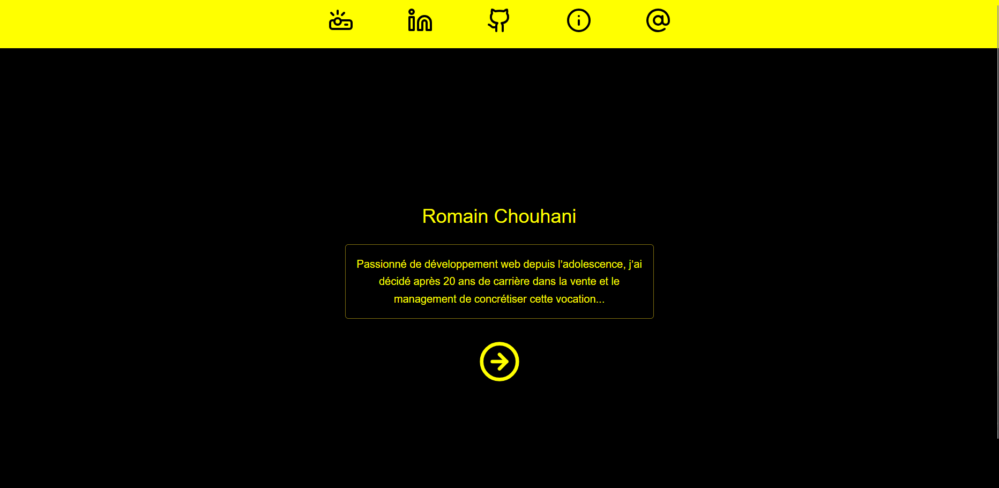

# 🌐 Portfolio — Romain Chouhani

Portfolio personnel développé avec Next.js afin de présenter mes projets de manière claire, accessible et professionnelle, en complément de GitHub et LinkedIn.

---

## 🔎 Aperçu du projet

Ce portfolio est une vitrine centralisant :

- mes projets personnels et collaboratifs  
- les apprentissages associés  
- les axes d’amélioration identifiés  
- les liens vers les versions déployées  

L’objectif est de proposer un point d’entrée simple et visuel pour toute personne souhaitant découvrir mon travail, sans nécessairement naviguer sur GitHub.

👉 Accès au portfolio :  
https://romainchouhani.vercel.app

---

## ✨ Fonctionnalités

- Présentation structurée des projets  
- Mise en avant des apprentissages et axes d’amélioration  
- Liens vers les déploiements  
- Interface responsive  
- Navigation simple et rapide  

---

## 🛠️ Stack technique

- **Next.js**
- **Tailwind CSS**
- **Lucide React**
- Déploiement : **Vercel**

---

## 🗺️ Roadmap

- Améliorations continues de l’UX  
- Ajustements de contenu selon l’évolution de mes projets  
- Optimisations éventuelles  

---

## 👨‍💻 Auteur

**Romain Chouhani**  
Développeur Fullstack

- LinkedIn : https://www.linkedin.com/in/romain-chouhani-334b1586/  